# The Chinese Godfather Meme Chain

A meme chain featuring an old Hong Kong TV show (?80's-90's). The show's time setting is during the WW2 years.
```
The Bund
```

Some things are better on the theater screen than in real life. The show was actually much better than the majority 
of films I've seen. However, it suffers the same problem as The Godfather Trilogy. Instead of the Romanism/Italian 
bend, the show was a little too action-packed at times. I won't elaborate anymore on this, besides from phrasing 
this problem, persistent throughout the spectrum of film, as "the curse of dramatism". In other words, I'm saying 
the gravity of some things cannot be depicted without lying. 

------------------------------------------------------------------------------------------------------------------

 

------------------------------------------------------------------------------------------------------------------

 

------------------------------------------------------------------------------------------------------------------

 

------------------------------------------------------------------------------------------------------------------

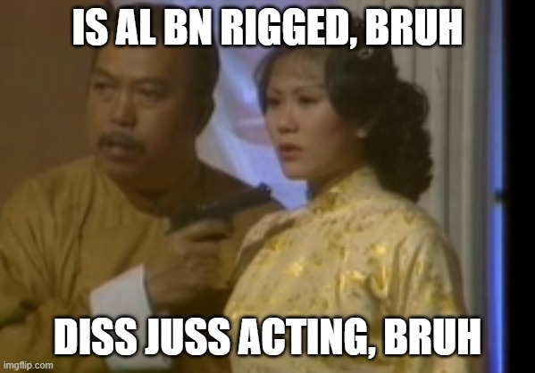 

------------------------------------------------------------------------------------------------------------------

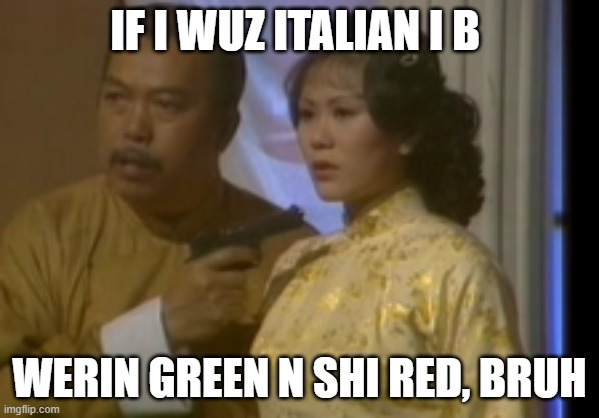 

------------------------------------------------------------------------------------------------------------------

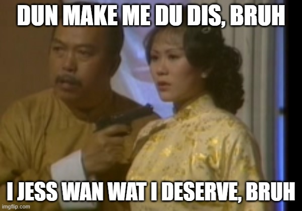 

------------------------------------------------------------------------------------------------------------------

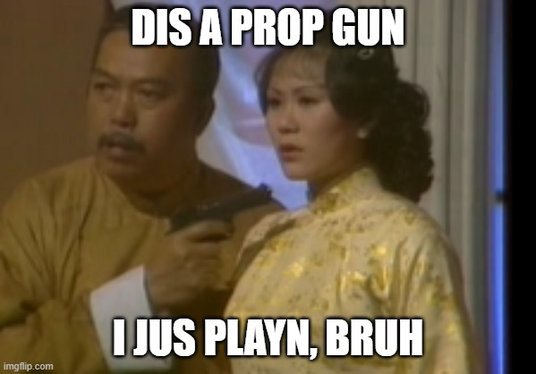 

------------------------------------------------------------------------------------------------------------------

 

------------------------------------------------------------------------------------------------------------------

 

------------------------------------------------------------------------------------------------------------------

 

------------------------------------------------------------------------------------------------------------------

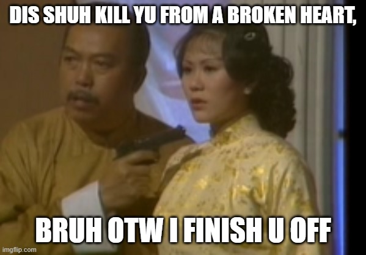 

------------------------------------------------------------------------------------------------------------------

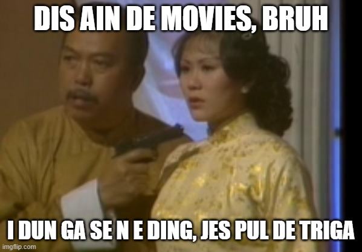 

------------------------------------------------------------------------------------------------------------------

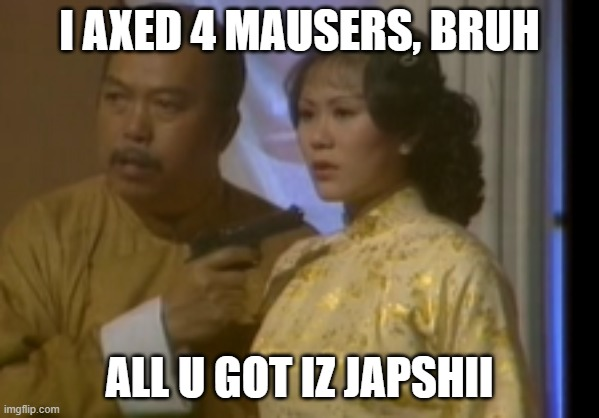 

------------------------------------------------------------------------------------------------------------------

 

------------------------------------------------------------------------------------------------------------------

 

------------------------------------------------------------------------------------------------------------------

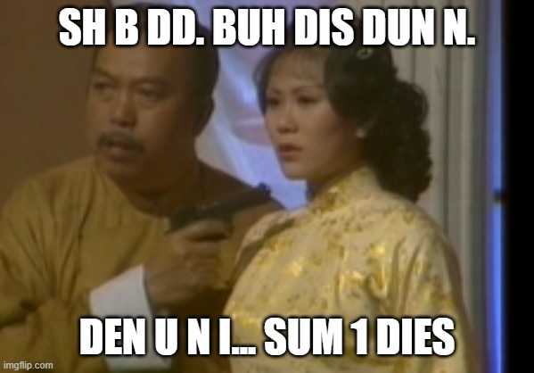 

------------------------------------------------------------------------------------------------------------------

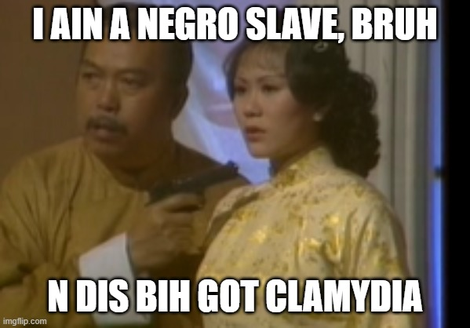 

------------------------------------------------------------------------------------------------------------------

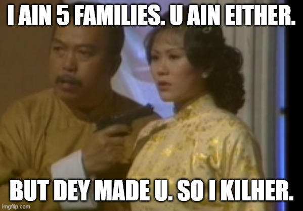 

------------------------------------------------------------------------------------------------------------------

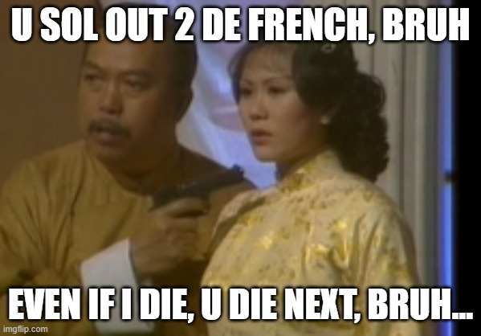 

------------------------------------------------------------------------------------------------------------------

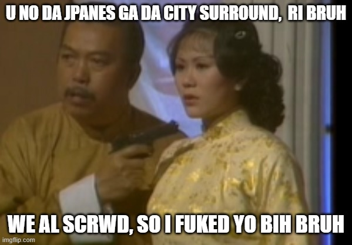 

------------------------------------------------------------------------------------------------------------------


------------------------------------------------------------------------------------------------------------------


------------------------------------------------------------------------------------------------------------------


